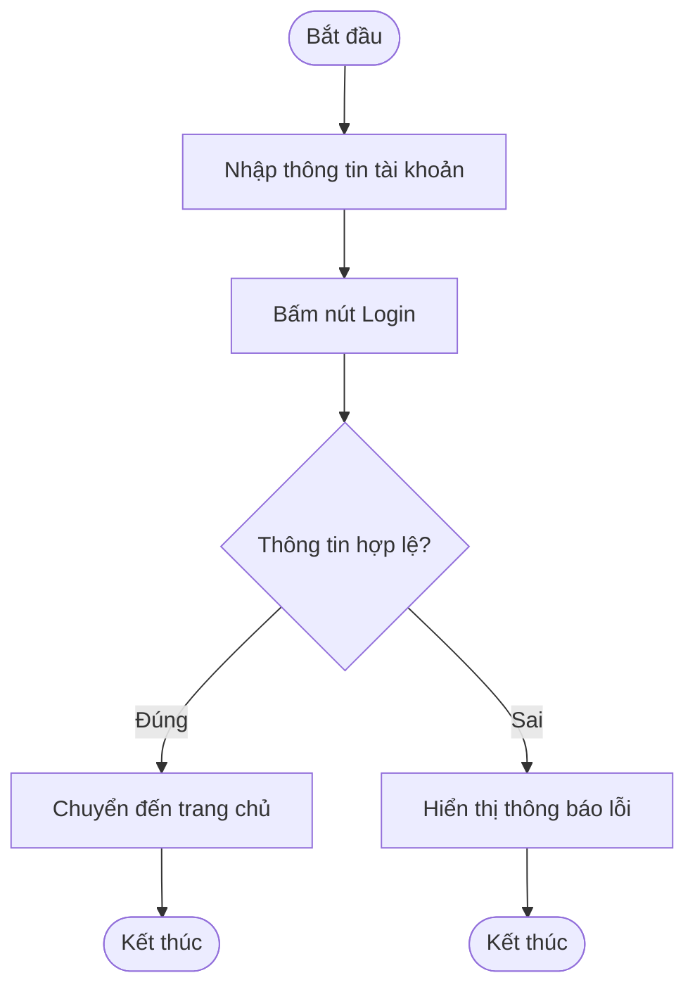

# Sơ đồ Activity – Đăng nhập

```mermaid
flowchart TD
    S(["Bắt đầu"]) --> A1
    A1["Nhập thông tin tài khoản"] --> A2
    A2["Bấm nút Login"] --> D1
    D1{"Thông tin hợp lệ?"}
    D1 -- "Đúng" --> A3
    D1 -- "Sai" --> A4
    A3["Chuyển đến trang chủ"] --> E1
    A4["Hiển thị thông báo lỗi"] --> E2
    E1(["Kết thúc"])
    E2(["Kết thúc"])
```