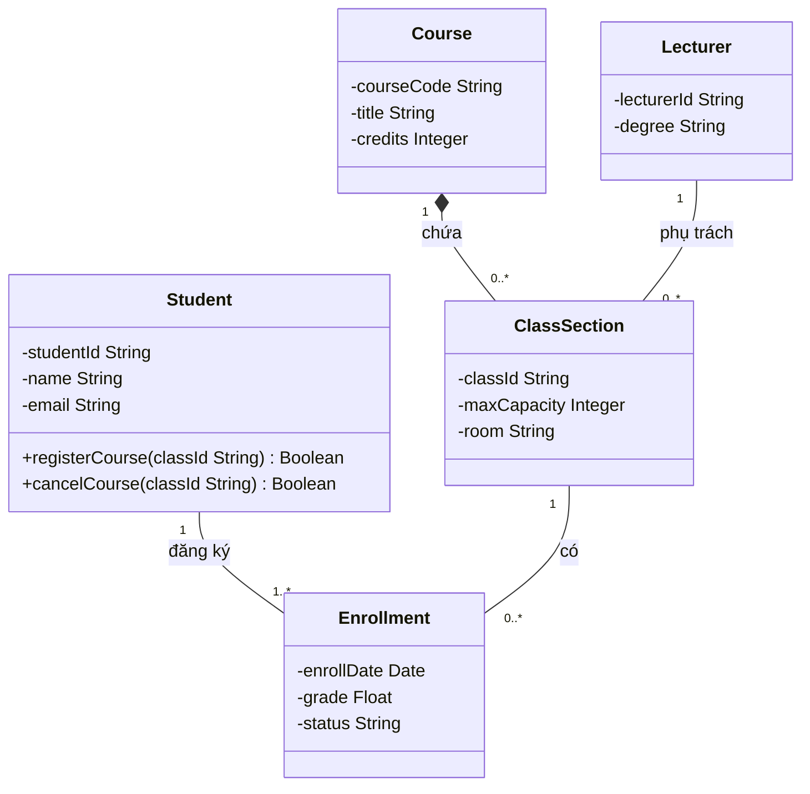

```mermaid
classDiagram
    direction TB

    class Student {
        -studentId String
        -name String
        -email String
        +registerCourse(classId String) Boolean
        +cancelCourse(classId String) Boolean
    }

    class Course {
        -courseCode String
        -title String
        -credits Integer
    }

    class ClassSection {
        -classId String
        -maxCapacity Integer
        -room String
    }

    class Enrollment {
        -enrollDate Date
        -grade Float
        -status String
    }

    class Lecturer {
        -lecturerId String
        -degree String
    }

    Course "1" *-- "0..*" ClassSection : chứa
    Student "1" -- "1..*" Enrollment : đăng ký
    ClassSection "1" -- "0..*" Enrollment : có
    Lecturer "1" -- "0..*" ClassSection : phụ trách
```