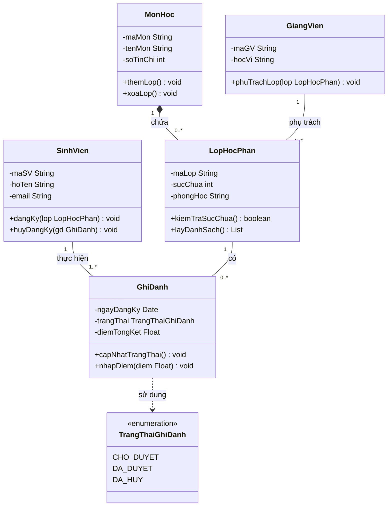

```mermaid
classDiagram
    direction TB

    class SinhVien {
        -maSV String
        -hoTen String
        -email String
        +dangKy(lop LopHocPhan) void
        +huyDangKy(gd GhiDanh) void
    }

    class GiangVien {
        -maGV String
        -hocVi String
        +phuTrachLop(lop LopHocPhan) void
    }

    class MonHoc {
        -maMon String
        -tenMon String
        -soTinChi int
        +themLop() void
        +xoaLop() void
    }

    class LopHocPhan {
        -maLop String
        -sucChua int
        -phongHoc String
        +kiemTraSucChua() boolean
        +layDanhSach() List
    }

    class GhiDanh {
        -ngayDangKy Date
        -trangThai TrangThaiGhiDanh
        -diemTongKet Float
        +capNhatTrangThai() void
        +nhapDiem(diem Float) void
    }

    class TrangThaiGhiDanh {
        <<enumeration>>
        CHO_DUYET
        DA_DUYET
        DA_HUY
    }

    MonHoc "1" *-- "0..*" LopHocPhan : chứa
    GiangVien "1" -- "0..*" LopHocPhan : phụ trách
    SinhVien "1" -- "1..*" GhiDanh : thực hiện
    LopHocPhan "1" -- "0..*" GhiDanh : có
    GhiDanh ..> TrangThaiGhiDanh : sử dụng
```
