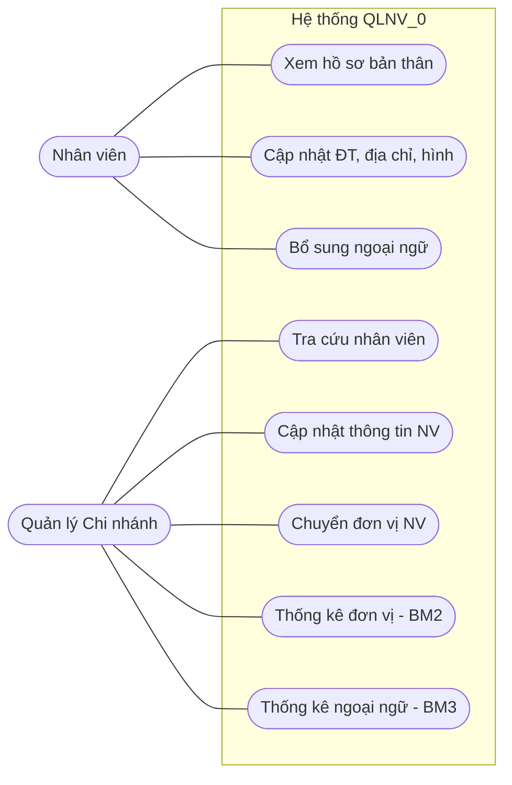

# Sơ đồ Use Case – QLNV_0

```mermaid
flowchart LR
    NV(["Nhân viên"])
    QL(["Quản lý Chi nhánh"])
    subgraph sys["Hệ thống QLNV_0"]
        UC1(["Xem hồ sơ bản thân"])
        UC2(["Cập nhật ĐT, địa chỉ, hình"])
        UC3(["Bổ sung ngoại ngữ"])
        UC4(["Tra cứu nhân viên"])
        UC5(["Cập nhật thông tin NV"])
        UC6(["Chuyển đơn vị NV"])
        UC7(["Thống kê đơn vị - BM2"])
        UC8(["Thống kê ngoại ngữ - BM3"])
    end
    NV --- UC1
    NV --- UC2
    NV --- UC3
    QL --- UC4
    QL --- UC5
    QL --- UC6
    QL --- UC7
    QL --- UC8
```